# Turnigy Brushless 4WD buggy

The Turnigy 1/16th 4WD Brushless Buggy is a well made RC car which comes 
at a reasonable price. The car can be bought from [HobbyKing](https://hobbyking.com/en_us/turnigy-1-16-brushless-4wd-racing-buggy-w-25a-power-system-and-2-4ghz-radio-rtr.html?gclid=CjwKCAjwqqrmBRAAEiwAdpDXtFS4SQOmtAFHIMZ9HrEiBeGwMeOg9UfNnKB6_Nr-yxoUUoyarf6FORoC7NgQAvD_BwE&gclsrc=aw.ds&___store=en_us). 

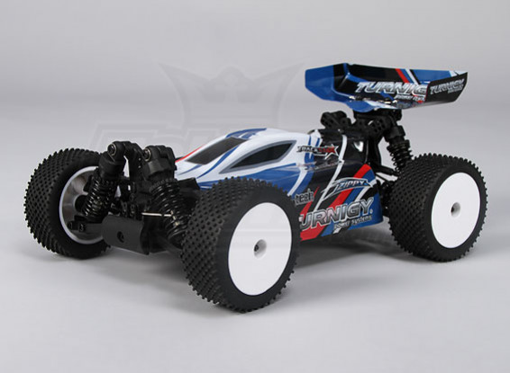

I bought the buggy to build my donkey car on it. When I started with the 
donkey project the standard cars were not easily available in Europe. 
Using this buggy is for sure not as straight forward as building the 
_standard_ Exceed or Magnet:
* the car needs some modifications in order to be usable as a donkey car
* the modifications are an additional investment (probably more in time 
than in $)
* for that work you need to be happy to do some mechanical work, like 
drilling, using a file if you use metal, etc
* for making things neat and fitting well, it's very handy to have access 
to a 3D printer and use some CAD software (I'm using Fusion360). 

I am not familiar with the Exceed or Magnet car, but judging the pictures 
and the specs, I think that the Turnigy buggy is at least as good as the 
standard cars. Doing that build has been an interesting experience during 
which I took several detours and  made many mistakes. I could say I spent 
a good amount of effort in R&D but it was more like T&E (trial & error). 
Finally, I think I have now converged towards a good vehicle with high 
quality driving behaviour and a very robust architecture, so I'll share 
my build here. If you start a non-standard _roll-your-own_ build with 
another similar sized car, ie. 1/18 to 1/14 scale, the parts and 
approach below might work for you too. 

As I am driving the car mainly outside my goal was to build a robust car 
that does not disintegrate when hitting a stone or similar obstacle. 
Also I want to avoid dirt and/or water getting too close to the 
electronics.

## Parts to chuck out
The buggy comes with a small ESC and quite powerful brushless motor. 
According the specs it is supposed to run up to 25mph. This is probably 
great for racing around in the backyard but not so suitable for running 
donkey on it as you will require good control at low speeds. I tried a 
couple of laps in the garden before I started the donkey car build and 
it was fun to drive but hard to control (as I am no RC driver). It was 
also quite noisy, and the motor as well as the ESC reached high 
temperatures in action.

## Parts to buy
For the motor I settled with the Turnigy SK3 2836 1040 from 
[HobbyKing](https://hobbyking.com/en_us/turnigy-aerodrive-sk3-2836-1040kv-brushless-outrunner-motor.html?gclsrc=aw.ds&gclid=CjwKCAjwwvfrBRBIEiwA2nFiPUKxThyzLSzGWZayfOwnxFth31bcAuTGR65S_pAo1QQNIYw3izbd0RoCejoQAvD_BwE&___store=en_us). 
This is a brushless outrunner motor with good power and lowest kV that I 
could find. Meaning it runs well also on lower RPMs. It also has a can 
diameter of 28mm, which means it will just fit into the car, whereas all 
the 1/10 RC motors with their 36mm can diameter will not. In order to 
drive the spur gear there is also a motor pinion for a 3.175 shaft 
required. I chose 14 teeth, 15 will fit, too. This is a standard RC part 
that can be bought in any RC online shop.
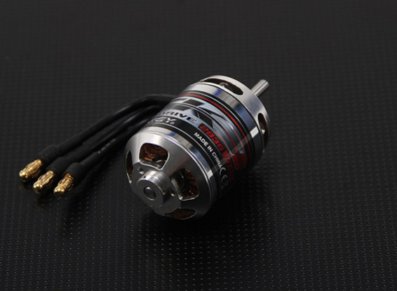

When I first got the motor and hooked it up to the original car's ESC I 
found it was not suitable either, as it required some throttle to get 
started and could not run on low speeds. Although the high speed was 
less than the original car in-runner motor. After reading that 
non-sensored brushless motors would not have enough passive control 
through a standard sensorless ESC I initially gave up on the plan to use 
that motor and went with a brushed motor/ESC combination instead initially. 
However, I found that after changing the ESC I could run the motor very 
well at low speeds in a very controllable way. I am using a cheap ESC 
from [Ebay](https://www.ebay.co.uk/itm/45-120A-ESC-Sensored-Brushless-Speed-Controller-for-RC-1-8-1-10-Car-Crawler/123836633866?ssPageName=STRK%3AMEBIDX%3AIT&var=424542043077&_trksid=p2057872.m2749.l2649). 
It turns out that this works brilliantly in the combination with the SK3 
outrunner motor.
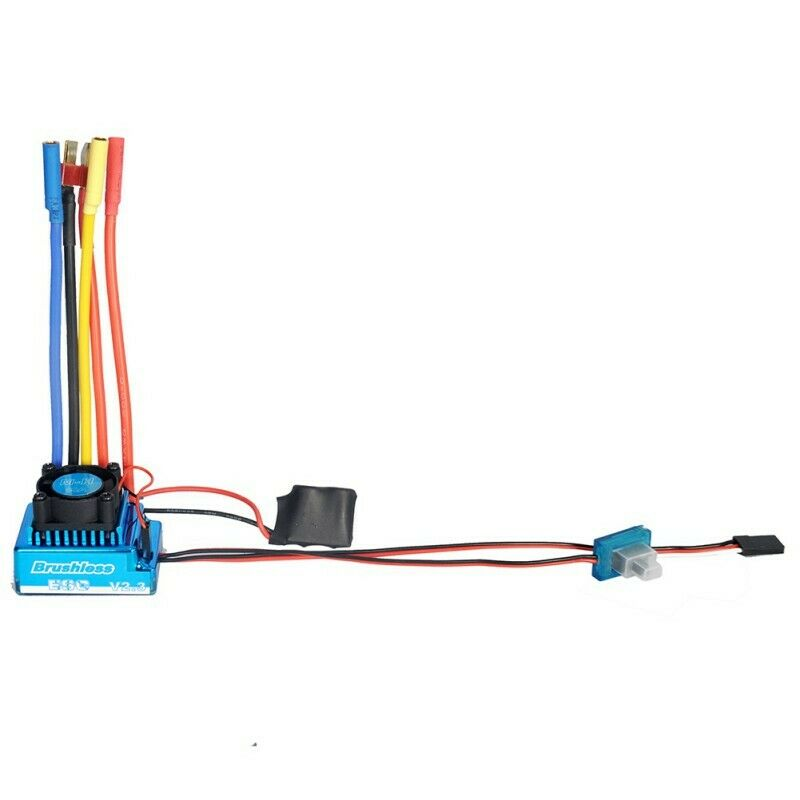

So far it looks like that the motor and the ESC are not developing any 
heat even when going at full throttle.

## The build
### The chassis
In order to fit the motor into the original mounting bracket there is 
some filing or drilling required as the motor mount hole pattern of the 
larger SK3 motor does not fit the original holes. Here is a picture with 
only the chassis of the car with the motor mounted (wheels look like 
they are not parallel but this is somehow due to the iPhone picture 
optics...)

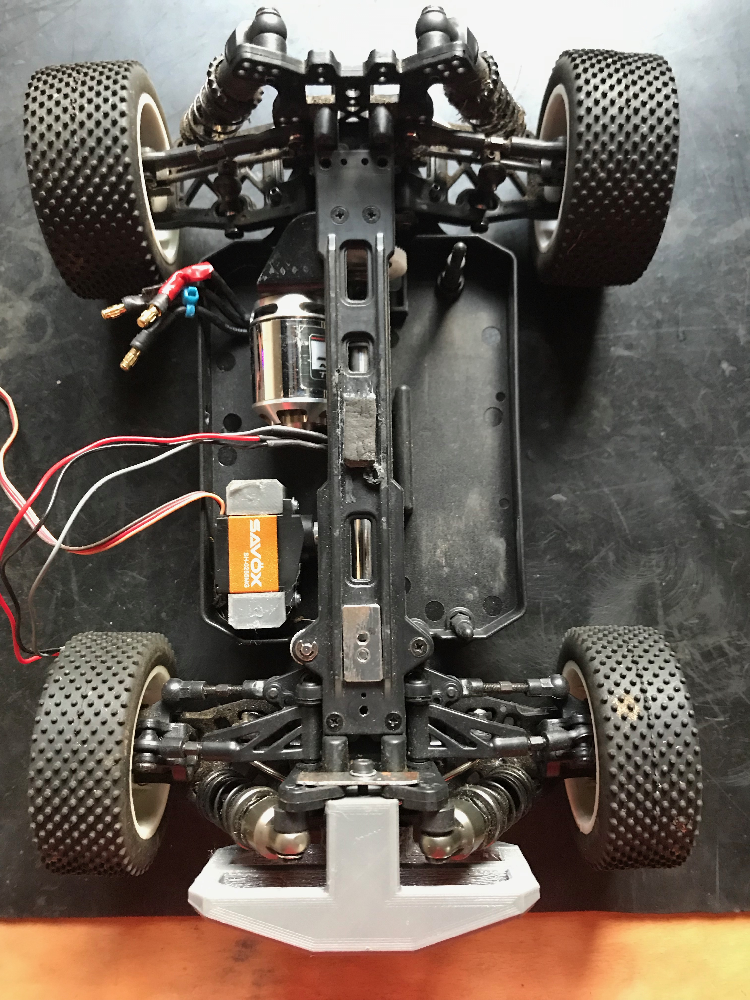

Here is the motor as seen from the side. In the background is my 
odometer disc that is mounted on the drive shaft.
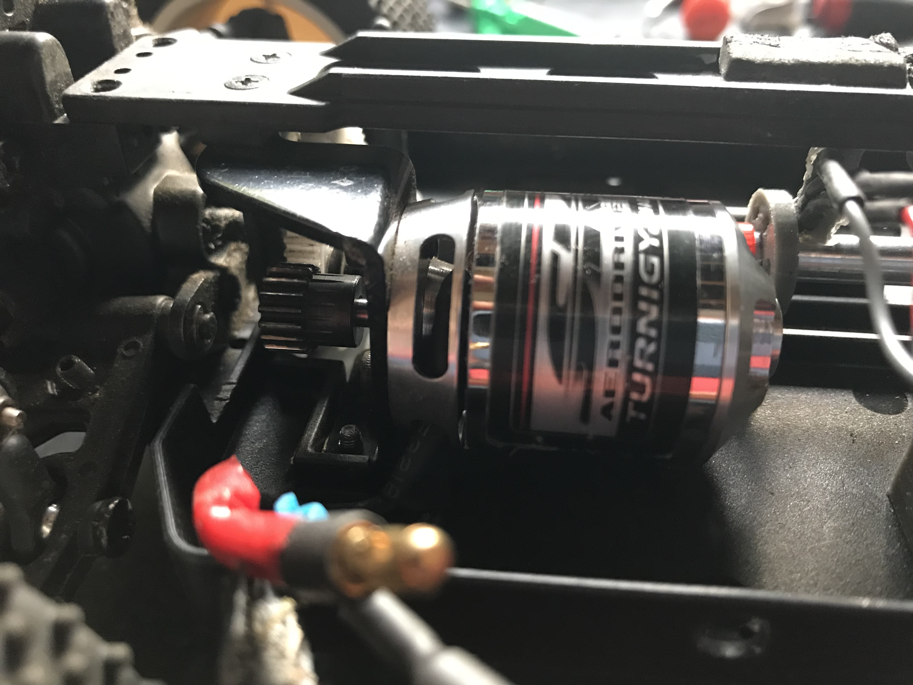

This is the steering servo. I had to replace it after the original servo 
broke. 
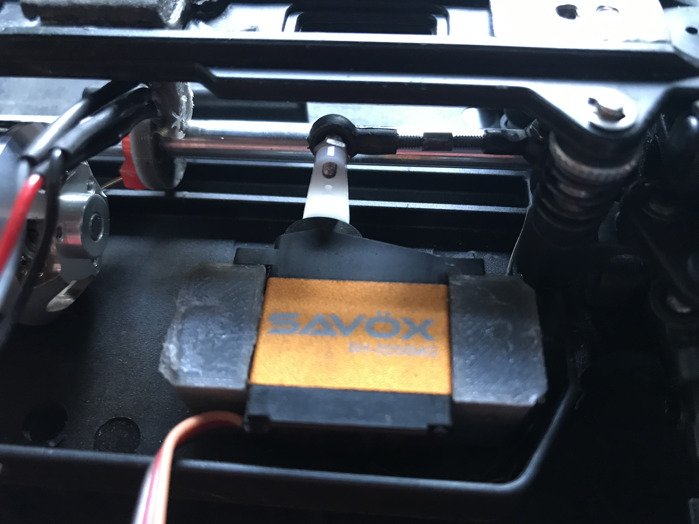

My donkey car has been involved in many crashless - mostly due reckless 
driving when on its own, ignoring physical obstacles and doing all kind 
of stubborn juvenile behaviour. Some hard crash broke the front 
suspension unit that I replaced w/ an upgraded metal suspension one. But 
long story short, donkey needs a front bumper to protect him from 
himself, so I made a 3D printed part (actually I made 2 parts, the first 
one not strong enough as donkey broke that one almost immediately, too).
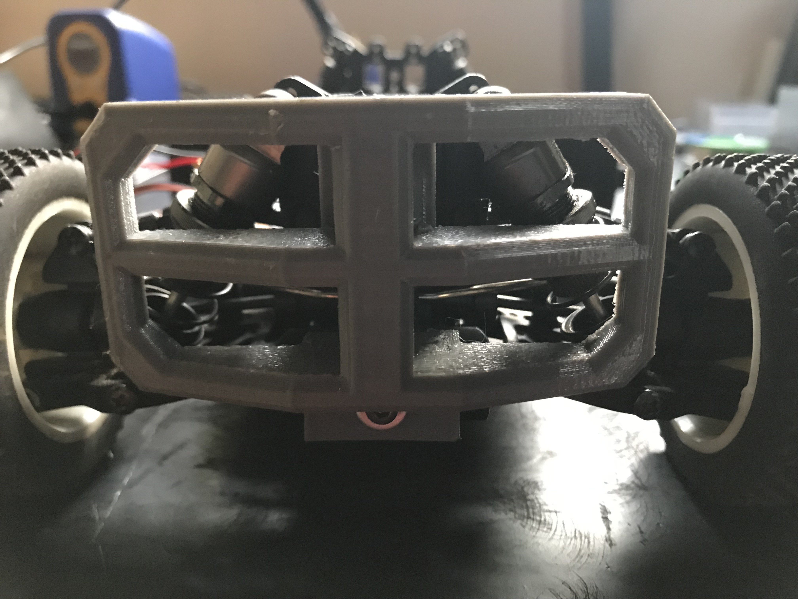
Here is where the bumper is fixed on the upper end.
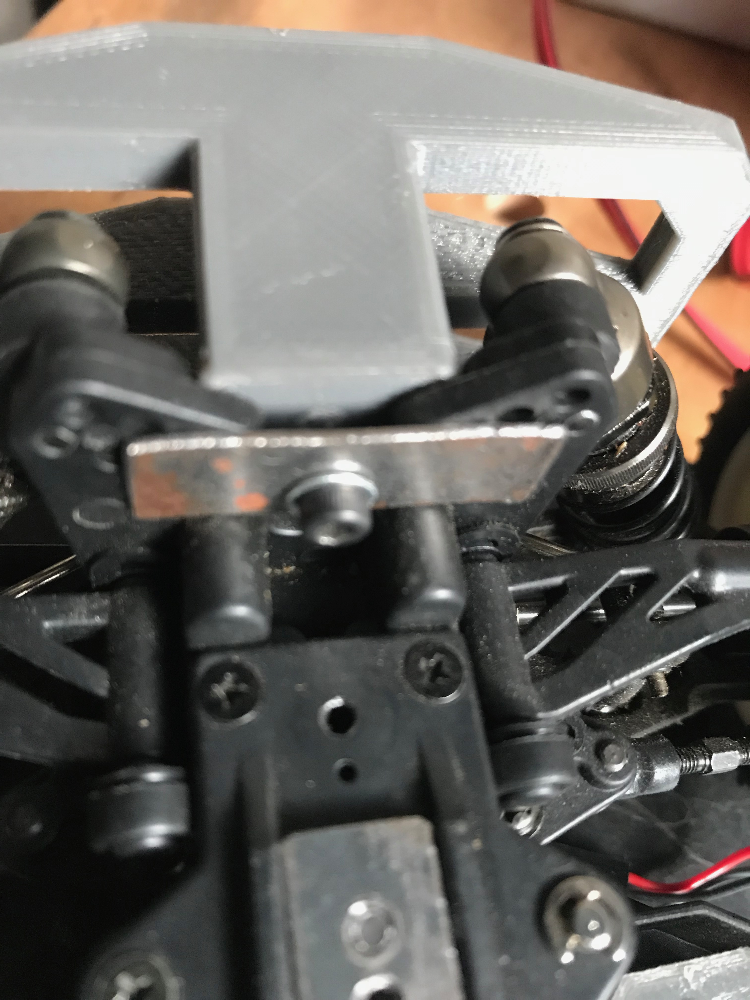

### The base
I decided to create a fixed base plate that is mounted to the chassis 
with strong joints. I also wanted a camera holder to be fixed to the 
frame but with the option to remove the camera from it or to remove the 
electronics without much hassle. Therefore I created a base plate and 
camera holder from 1mm sheet metal (mild steel) and a 3D-printed 
electronics carrier plate. The camera also has a 3D-printed case that is 
fixed to the holder with screws. Here are the parts:
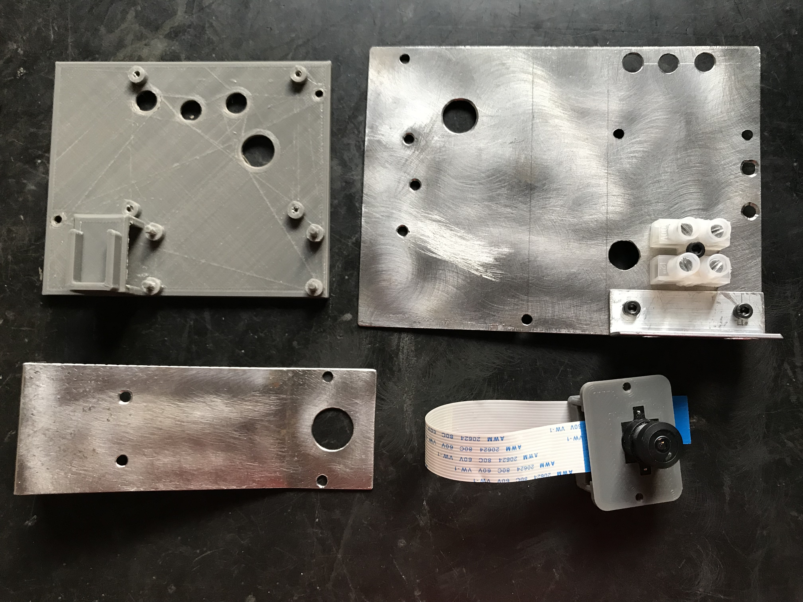

The base plate requires some amount of drilling hols for screws and 
cable openings. Here I already installed a rear aluminium angle bar for 
mounting the main switch and shut-down push button and screw terminals 
for the power distribution.
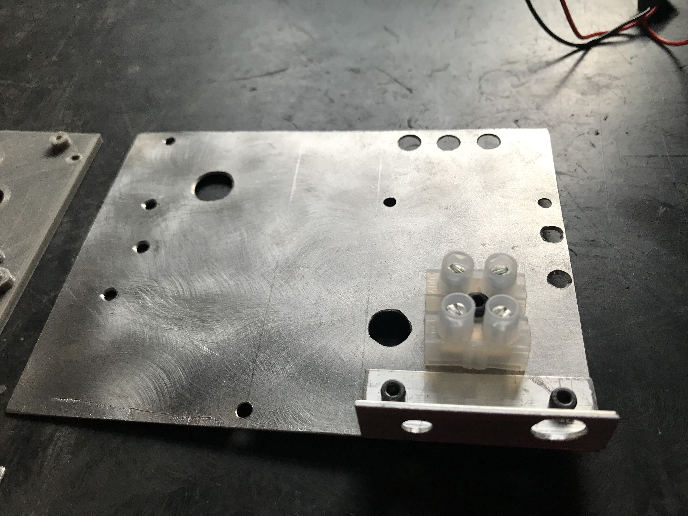

This is the camera holder with a right angle slotted plate, to feed the 
camera cable into the housing.

The electronic carrier was modelled in Fusion360, using CAD drawings for
the RPi and the PCA9685 for mounting studs. It also takes the RC 
receiver with a push fit and a 3 Amp voltage step dow converter (push 
fit plus a small bit of hot glue).

For the assembly I use 3mm hex cap head (i.e Allen) screws and beer. 
Washers and nuts are small and fiddly they fall down and disappear into 
hidden spaces, to keep your cool you use the beer. I have a whole box in 
all lenghts between 6mm and 40mm.
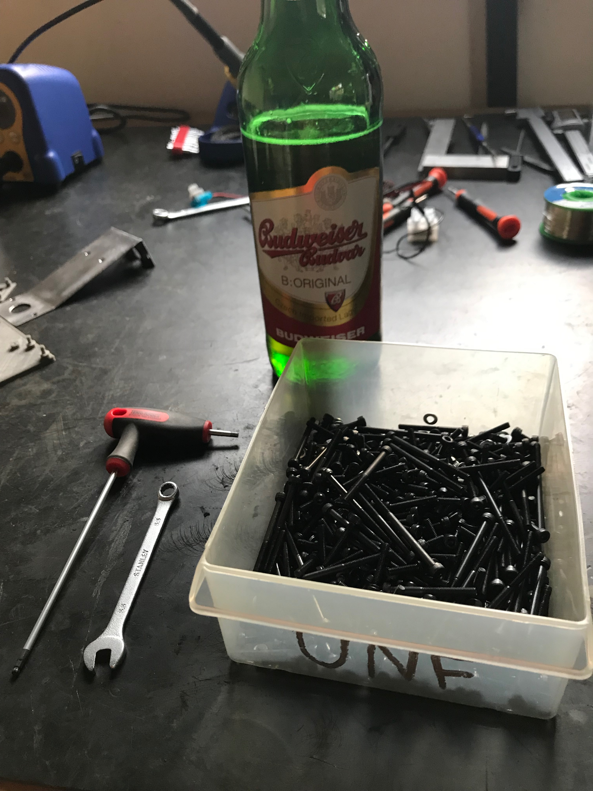

Mounting the camera holder with its angle bracket to the base plate.
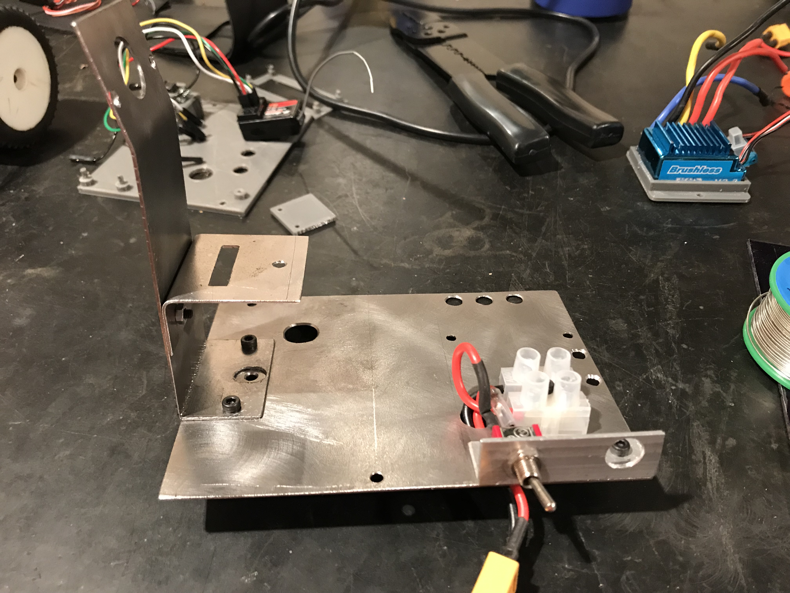

Mounting the on/off switch and connecting to terminals.

This is the angle bracket with the switch and the small push button 
installed. The latter allows to shut-down the RPi through setting a 
specific pin to ground. Please see Andrea [raspberry-pi-tricks](http://www.sensorsiot.org/raspberry-pi-tricks/) 
page.

To mount the ESC to the base plate I 3D printed as small holder with two 
holes for the screws.
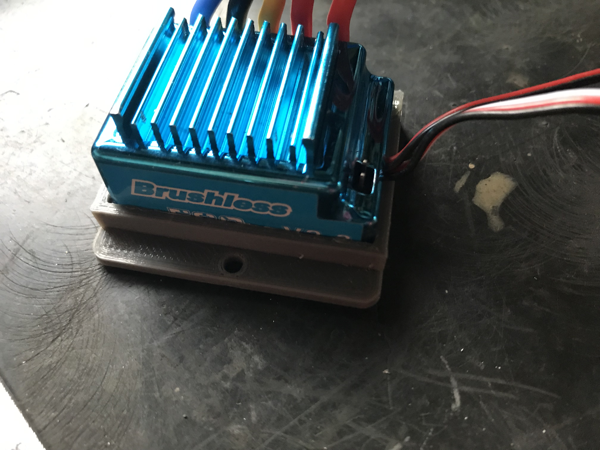

This is how it looks with all the electronics mounted on the rear of the 
base plate.

### The camera assembly
Here is a view of the camera case. The case is a 3D design where I 
modelled up the camera and used it as a tool to cut out the shape from a 
rectangular case. It mounts flush to the holder which has a hole for the 
lense.
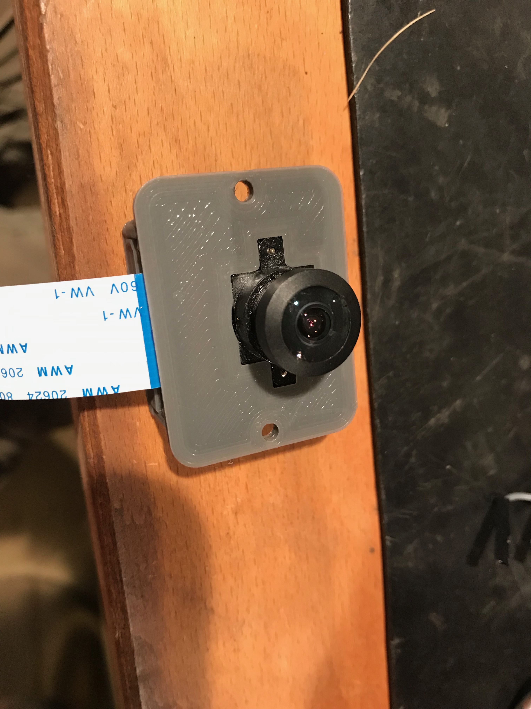

The holder assembled to the base plate and with the angular bracket 
attached which serves as a base for cover that is added later in the 
build. It also has a slot to pass through the camera ribbon cable.

I made a small grommit to create a tight fit around the cable.

### The electronics
Firstly I fitted the RC receiver into the push fit bracket on the carrier.

This is a tight fit and will not shake loose. There is no glue or 
anything required. In the CAD design I made the cutout in the bracket 
0.2mm larger than the measured dimension of the receiver. This required 
a small bit of filing. Likely 0.4mm would have worked, too.

Next was the PCA 9685 PWM driver board which just needs pushing onto the 
studs. The fit is really tight too and no further fasteners are needed. 
Top view here...
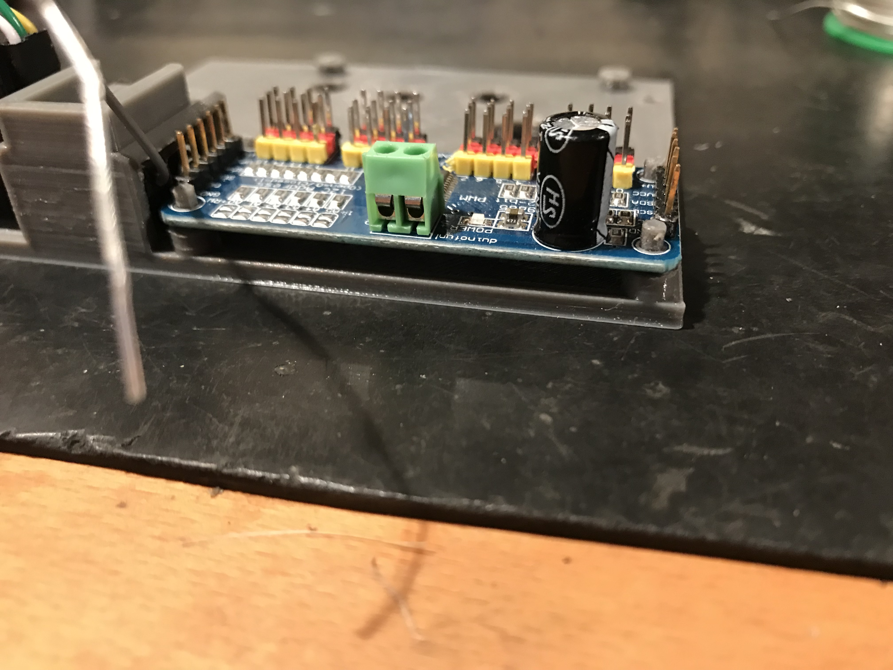
... and side view, here:
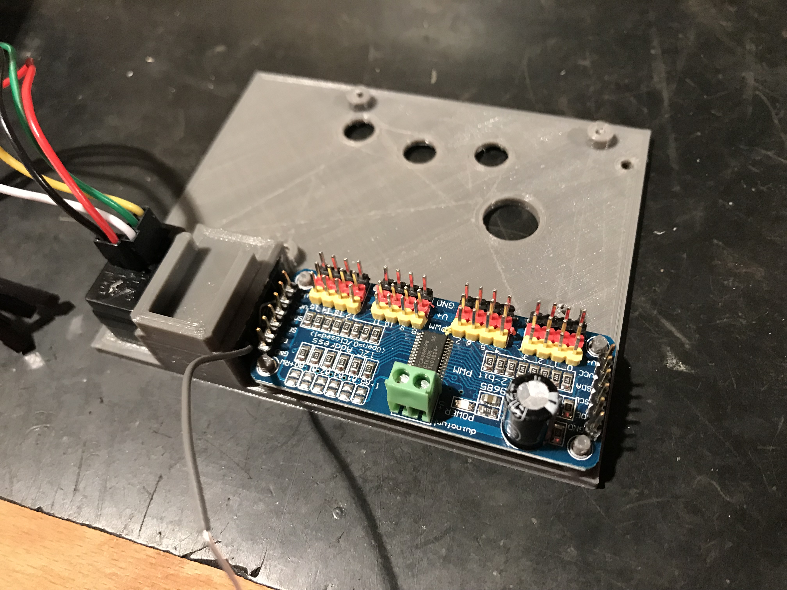

Afterwards attaching the RPi to the carrier plate with screws. My 
intention was to use the same printed studs like for the PWM driver pcb 
but it turned out that Cura (my 3D printer software) had decided to make 
the base columns of the RPi studs hollow which resulted in the top parts 
braking off. So I screwed in the RPi with four 2.5mm Philips plastic 
screws.

Here is a view of the RPi attached and the carrier already provisionally 
moved into place.

This is the whole base plate of the car. Also the voltage converter is 
attached now. The fit is not tight enough to hold that mini pcb inside 
the cutout area. I therefore put a small bit of hot glue in between.

This is the whole car from the top. There is obviously not much space 
left. Making the base plate larger is also not an option as it would 
start fouling one of the tires if the suspension gets fully compressed.
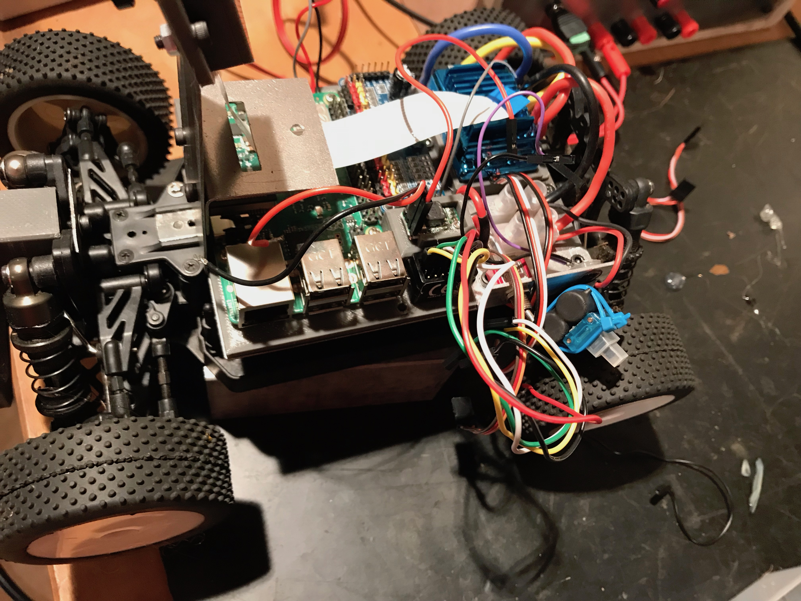

### Fixing and cables
There is whole for the power supply cables to the battert (in my case 
XT-60) plug.

Now I fixed the electronics carrier with 2 screws to the base plate:
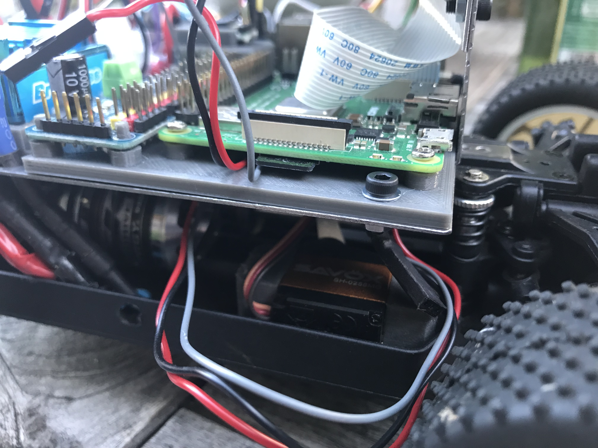

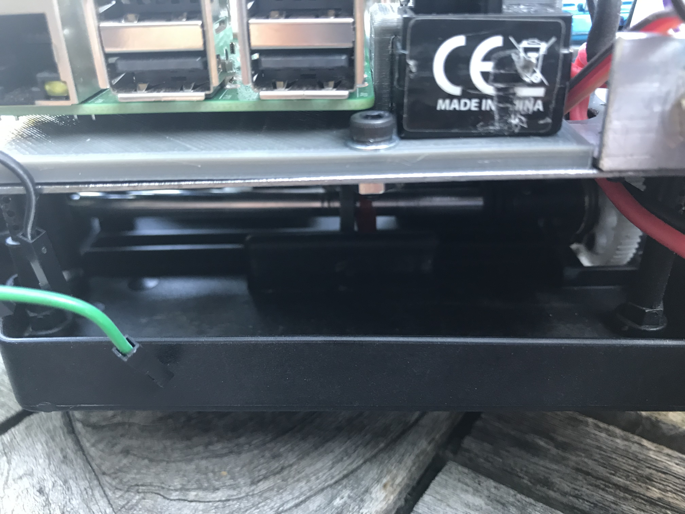

In the end I connected all cables:
* Battery+ to the voltage converter input
* Voltage converter output to RPi 5V input
* Battery- to RPi Gnd
* RPi +3.3V, Gnd, I2C SCL and SDA to PCA9685
* RPi +3.3V, Gnd and 3 channels to the RC receiver
* RPi +3.3V, Gnd and 1 channel to the odometer
As you are probably aware that the RPi has only 2 +3.3V pins - instead 
of making a Y-cable or adding a +3.3V power terminal, I just soldered 
the second row of pins to the PCA9685 and used +3.3V and Gnd from there.

For the ESC switch and the 2 capacitors I didn't have any space. I might 
create some bracket/holder for them in the future but for now I just put 
them into the rear area. With so many cables around they can't move very 
far. I also joined some cables with wires to tidy up the cable mess a 
little more.

### The cover
For the cover I 3D-printed a 2.4mm thick half case that fits the 
dimensions of the base, camera holder and rear angle bracket exactly. 
Again I used the technique to model up the internal parts of the base 
plate in one component first and then create a second component around 
the first one making use of the useful feature 'Project Geometry' in 
Fusion360. I also printed upside down and avoided any overhanging parts 
with < 45 degree, so no support was needed. 
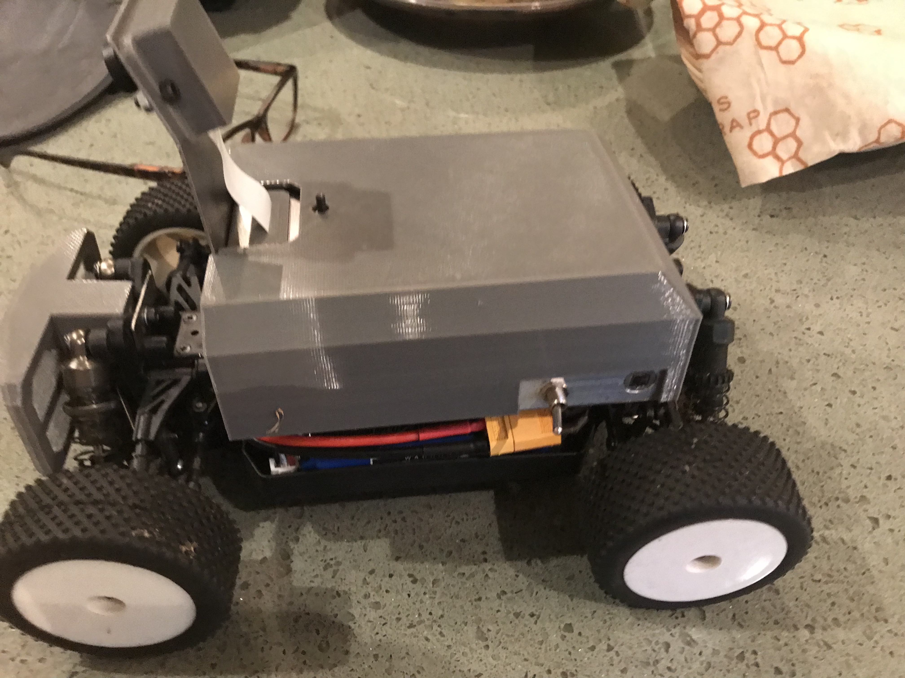

The cover sits on the front angle bracket of the camera holder into 
which put a 3mm screw with a hex nut. There is a corresponding cut out 
in the cover so it fits exactly over it and I bolted it down with a 
small piece of sheet metal to spread the load. 
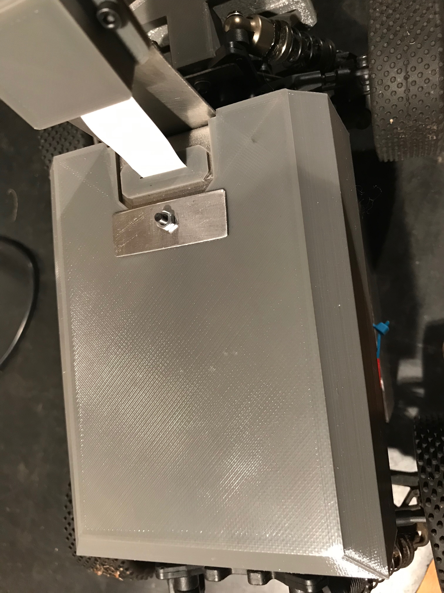

This is the rear cutout area where the switch and push button are 
accessible.
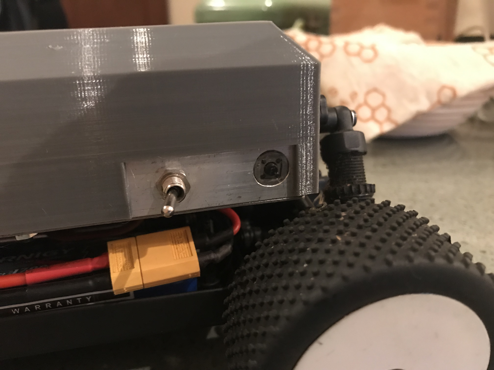

The front of the donkey car has a small cutout to supply the RPi with 
external power if needed.

The rear of the donkey car. I couldn't wait to try out the car 
hence it is already dirty. Here the cover is attached to the rear 
suspension tower with an m4 screw, just screwed into a spacer block that 
sticks out on the rear of the cover.
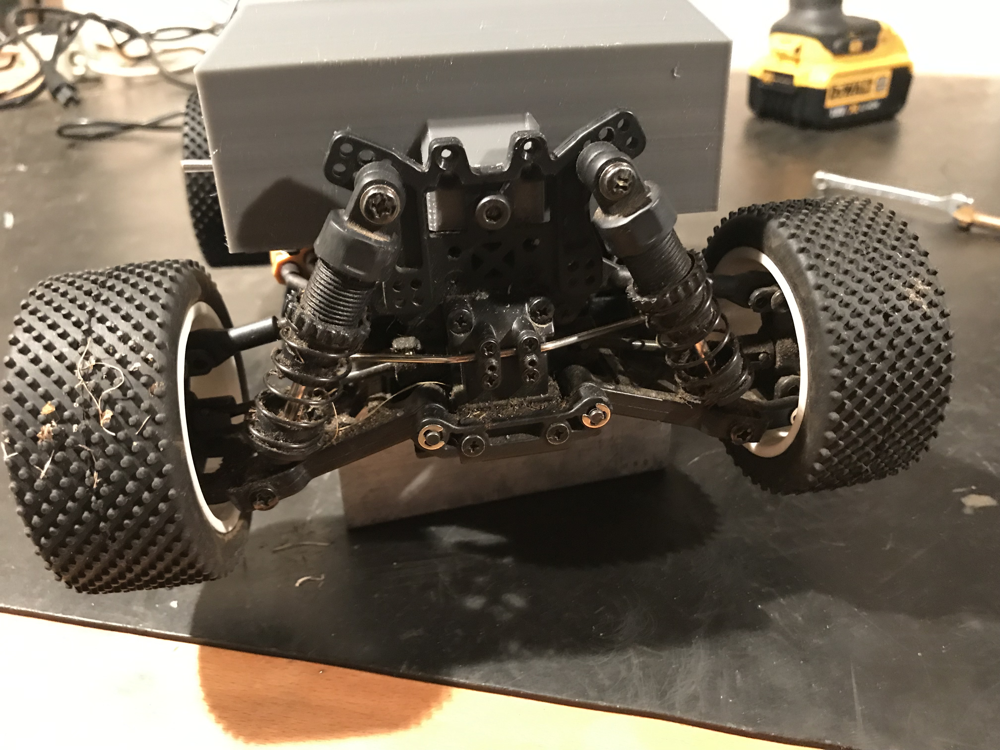

With the cover on, there is no way any dirt or water can get into the 
electronics and it keeps them reasonably shielded from physical impacts. 
All in all the whole construction now also feels rigid enough for 
hopefully many rounds of _fast_ and _out-of-control_ driving.

## To do
1. When running an outrunner motor there is no need to use an 
odometer on the drive shaft any longer utilising a disk with embedded 
neodym magnets. You get a much higher angular resolution when placing 
the hall sensor (I am using a bipolar latching SS460S) directly next to 
the rotating can of the motor. I will do this at some point.

1. The ESC and the motor are both specified for 3S so I could run the 
car at more power. Will try.

1. The spur gear is made of plastic and I chewed through already 2 of 
those. The spur gear - motor pinion alignment is generally not great in
the factory version of the buggy, there is a 
[video](https://www.youtube.com/watch?v=W_q0FRJMvM0) here, showing the 
issue and a (possible) resolution. This misalignment was no problem for
me as I removed the original motor and ran the car with a 370 motor for
some time as this allowed a more controlled throttle response. In the
aftermath I now know that the spur gear wear was likely due to the non-
perfect fit of the spur pinion gear of that 370 motor, as I just moved 
the pinion from the factory motor over. The gear was not perfectly 
centered and there was a small bid of wobble. After running with the SK3
motor which pinion fits more precise to the drive shaft I have observed 
almost no wear on the spur gear. I cannot recommend these 370 motors, as
they get very hot and I destroyed two of them during crashes, they seem
to be rather fragile.
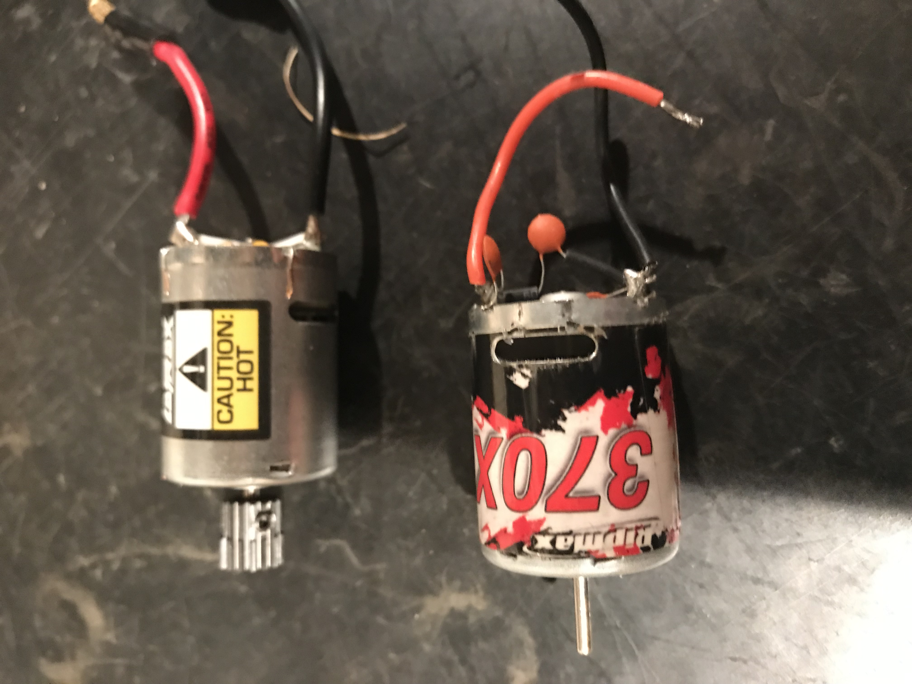
Even with the better alignment I would prefer a metal drive train 
throughout though.

1. I plan to also fit some sort of mini OLED display for showing 
battery charge and processor temperature or similar.

## Updates
1. Installed a bipolar latching hall effect sensor underneath the build plate 
   which now reads the outrunner magnets directly. This increases the resolution
   by a lot. I have now 630 ticks per meter.
   

2. I made more space for the 3S battery. This fits and works fine.

3. The RPi now has a cooling fan as it was throttling its CPU - thanks
   for the community help getting to the bottom of this. The fan
   required drilling holes into the cover, otherwise its rotation was
   too restricted leading to power drain and more throttling.

4. I made a lap timer and added it to the car.
   . It is activated by a
   sensor
   [TSOP 4838](https://www.ebay.co.uk/itm/2pcs-IR-Receiver-Module-38-kHz-TSOP4838-DIP-3-UK-SELLER-675/223411429453?ssPageName=STRK%3AMEBIDX%3AIT&_trksid=p2057872.m2749.l2649).
   The sensor recognises 38kHz pulsed IR lights, which is used in legacy
   IR remote controls. To read the signal into the car loop I made a
   donkey part for it. In order to generate the pulsed light I designed a
   simple timer 555-based circuit. Placing the light at some place on the 
   track makes the car record each time the sensor passes by. This gives me 
   laps counts and lap-times that I
   add to the tub - super useful. 
   
   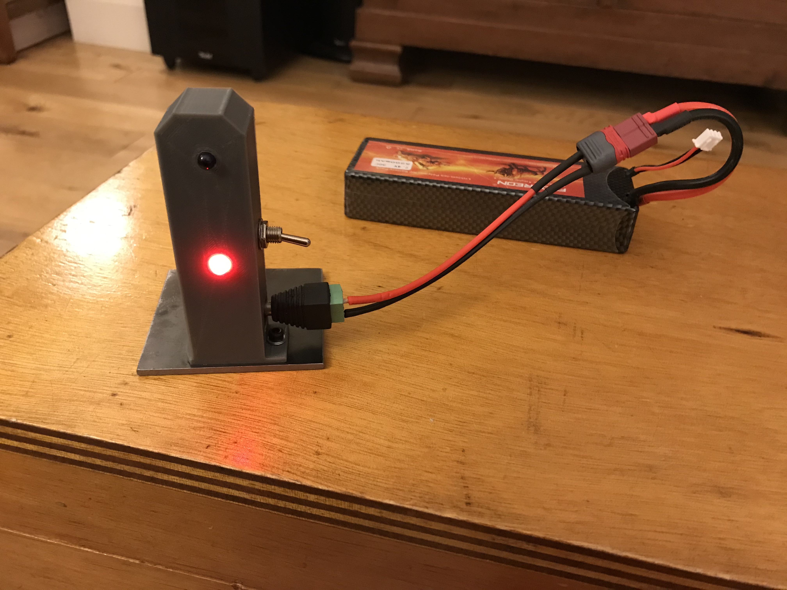 Please note, the IR diode emits
   non-visible light, what lights up red is just a status led showing
   the thing to be on/off.

5. And this is a sneak preview of s/th new... more to come soon.
   .

## More updates
1. After having experienced occasional missed lap readings from my IR sensor 
   I swapped out the TSOP_4383 against an TSSP58038. The TSOP_4383 is very 
   directional and when the car passes the sensor in the wrong angle or for 
   a too short interval it might not register. This is annoying because it 
   will spoil the data which is difficult to fix, once recorded with wrong 
   lap times and lap counts. 
   The TSSP58038 is very sensitive. In fact, it is very very very sensitive. 
   Switch on a 38kHz pulsed IR light pointing into any direction from (almost) 
   any position in the room and the sensor will trigger. In the beginning I 
   thought this was bad, but in fact, it is good. I buried the sensor with a 
   3D printed part about 1cm deep, see here:
   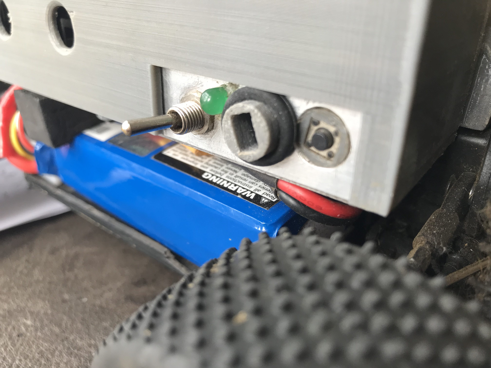
   Now, the sensor only triggers if it is within a relatively small angle. 
   But because of the high sensitivity, the distance between the car and the 
   emitter light can be large, even outside. 10m are no problem. You need to 
   be more careful now, where to place the emitter. Placing the emitter on the 
   wrong place on an S-formed shaped track segment will make it trigger 
   twice :-).
2. The laptimer mishaps above motivated me to also add an LED to the car. 
   The LED is of common cathode type and its three anodes are connected to 
   three channels on the PCA9685. Because the PCA9685 board has an integrated 
   resistor in series to the pwm output pin, you can connect LEDs to these 
   pins directly without the need of adding a resistor for the required 
   voltage drop.  
   
   I created a part for the LED - check out the code if you are interested, it 
   is using thread queues in order to achieve blinking behaviour that is 
   independent of the vehicle loop. Like sending a set of three red flashes 
   when the lap timer has been triggered or a violet flash when deleting 
   records from the tub, etc. The thread queue handles the management of 
   these display request, because there could be a couple of them within a 
   short time.